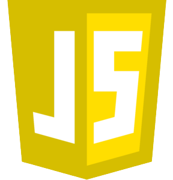
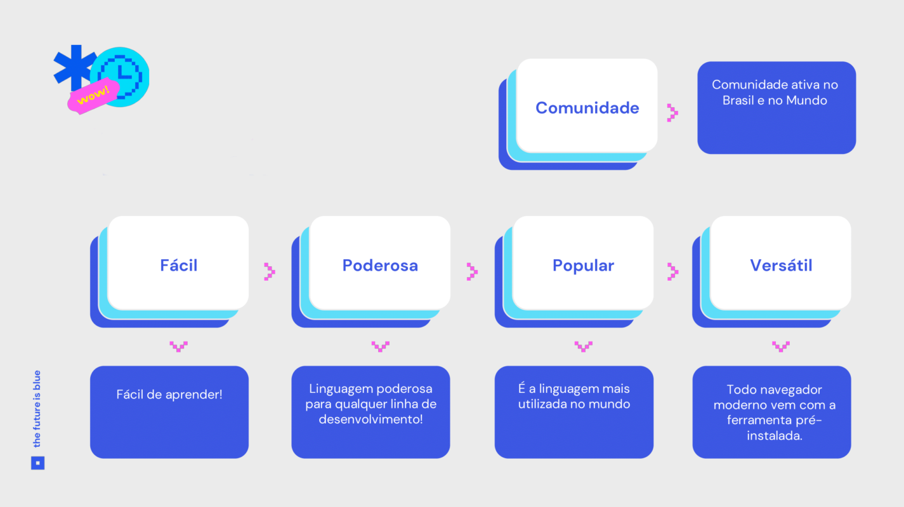
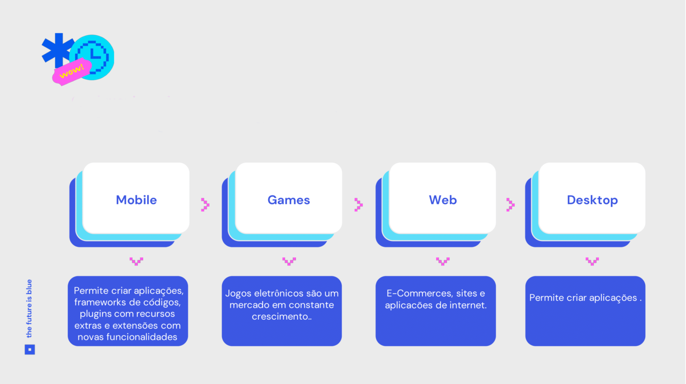
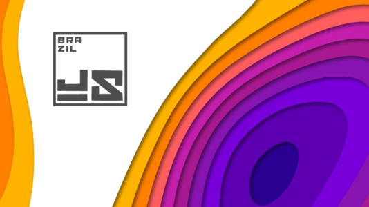
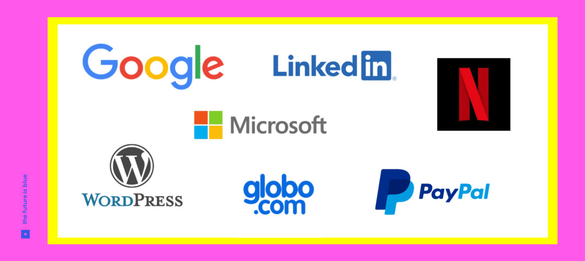
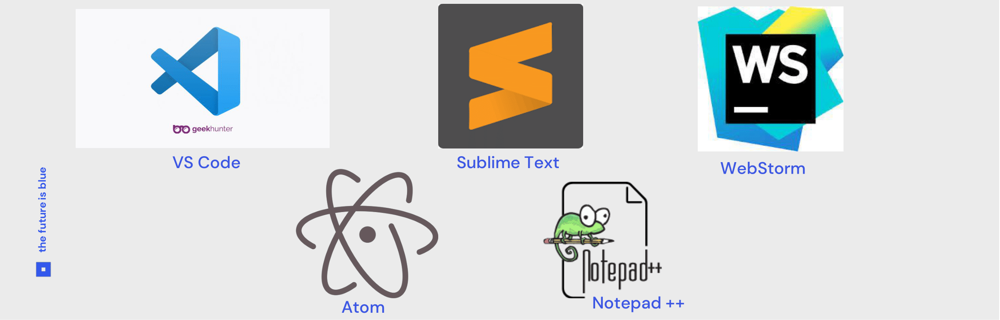

# Aula 01a - \[AULA] Introdução à Lógica e Linguagem JavaScript

## O que é lógica?

Lógica tem dois significados principais: discute o uso de **raciocínio** em alguma atividade e é o estudo normativo, filosófico do raciocínio válido. No segundo sentido, a lógica é discutida principalmente nas disciplinas de filosofia, matemática e ciência da computação.

## O que é lógica de programação?

Lógica de programação é a organização coesa de uma sequência de instruções voltadas à resolução de um problema, ou à criação de um software ou aplicação.

## **Linguagem de programação**

A linguagem de programação é um método padronizado, formado por um conjunto de regras sintáticas e semânticas, de implementação de um código fonte - que pode ser compilado e transformado em um programa de computador, ou usado como script interpretado - que informará instruções de processamento ao computador.

## **A Linguagem JavaScript!**

* ### É uma linguagem leve;
* ### Interpretada;&#x20;
* ### Baseada em objetos com <mark style="color:blue;">funções de primeira classe</mark>;&#x20;
* ### **Mais conhecida como a linguagem de script para páginas Web, mas usada também em **<mark style="color:blue;">**vários outros ambientes sem browser**</mark>**, tais como:**
* ### Node.js;&#x20;
* ### Apache CouchDB;&#x20;
* ### Adobe Acrobat;&#x20;
* ### Entre Outras;

****

## A Linguagem JavaScript!

O JavaScript é uma linguagem baseada em protótipos, multi-paradigma e dinâmica, suportando estilos de orientação a objetos, imperativos e declarativos (como por exemplo a programação funcional).

## Veja as vantagens do por que escolhemos JavaScript!

## Onde usar JavaScript?

## Comunidade JavaScript no Brasil!

A BrazilJS Conf nasceu como uma conferência sobre JavaScript, mas hoje é bem mais do que isso. É um evento que surgiu junto com a comunidade JavaScript/Front-end no Brasil, com quem cresceu e amadureceu.

## Empresas usando JavaScript no mundo.

## IDEs  JavaScriptt

Um IDE é um pacote de software que consolida as ferramentas básicas necessárias para escrever e testar softwares.

