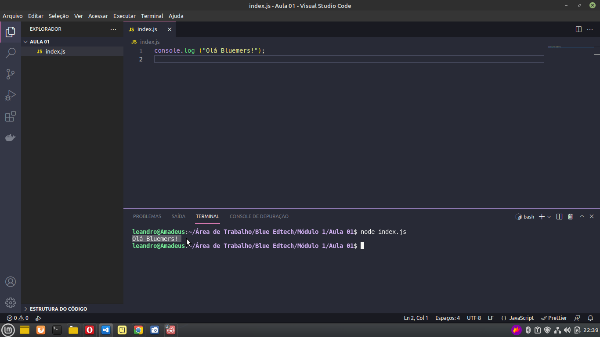
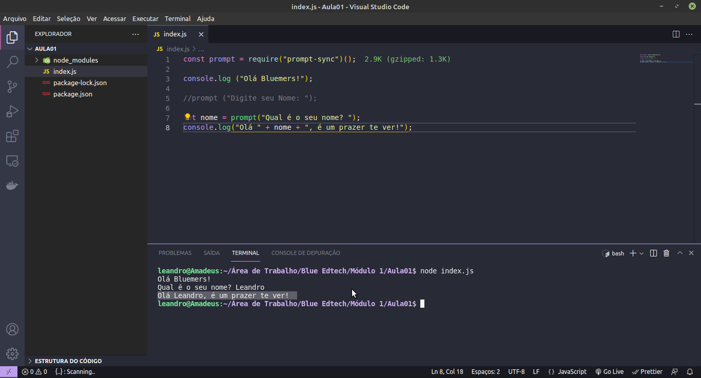
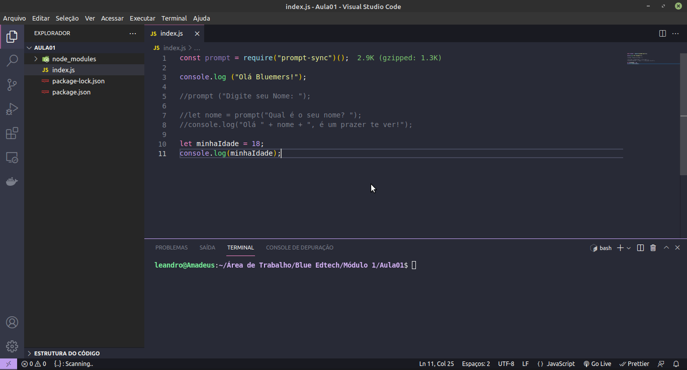

# Aula 01b - \[AULA] Variáveis, operadores matemáticos e console.log()

### O que vamos aprender?

* <mark style="color:blue;">**Características do JavaScript**</mark>
* <mark style="color:blue;">**Console.log();**</mark>
* <mark style="color:blue;">**Comando Prompt();**</mark>
* <mark style="color:blue;">**Variáveis em JavaScript**</mark>
* <mark style="color:blue;">**Operadores em JavaScript**</mark>

## Características do <mark style="color:blue;">JavaScript</mark>!

* Orientada a objeto;
* Sem distinção entre tipos e obejtos;
* A herança é feita através do protótipo;
* As propriedades e métodos podem ser adicionadas a qualquer objeto dinamicamente;
* Os tipos de dados das variáveis não precisam ser declaradas (tipagem dinâmica);
* Não pode escrever automaticamente no disco rigído;
* Linguagem não compilada;

#### Em resumo:

JavaScript é uma linguagem de script orientada a objetos, multiplataforma. É uma linguagem pequena e leve. Dentro de um ambiente de host (por exemplo, um navegador web) o JavaScript pode ser ligado aos objetos deste ambiente para prover um controle programático sobre eles.

## Processo de Organização!

Vamos preparar nosso ambiente de trabalho criando uma pasta chamada <mark style="color:blue;">**"Blue Edtech",**</mark> escolha o melhor local para criar está pasta.

 (1).png>)

Agora dentro da pasta <mark style="color:blue;">**"Blue Edtech"**</mark> vamos criar outra pasta chamada <mark style="color:blue;">**"Módulo 1"**</mark>.


Dentro da pasta <mark style="color:blue;">**"Módulo 1"**</mark> vamos criar uma pasta chamada <mark style="color:blue;">**"Aula01"**</mark>.


Agora clique com o botão direiro do mouse na pasta <mark style="color:blue;">**"Aula01"**</mark>, vai aparecer está aba, em <mark style="color:blue;">**"abrir com"**</mark> selecione o <mark style="color:blue;">**"VSCode"**</mark>.


Agora que já estamos dentro do VsCode, vamos colocar a mão na massa e criar nosso primeiro arquivo.

Nesse momento estamos dentro da pasta <mark style="color:blue;">**"Aula01"**</mark>, vamos criar um <mark style="color:blue;">**"Novo Arquivo"**</mark>.


Vamos nomear nosso "Novo Arquivo" de <mark style="color:blue;">**index.js**</mark> e apertar o entrer, com isso o arquivo será criado e aberto ao lado conforme imagem abaixo.


Agora vamos aprender nosso primeiro comando.

## Console.log() em JavaScript

Exibe uma mensagem na console do navegador.

Considerado "mais agradável" para a exibição de uma mensagem por não envolver um pop-up. A mensagem será exibida no sonsole do navegador.

### Sintaxe:

console.log(obj1\[, obj2, ..., objN]);

console.log(msg\[, subst1, ..., substN]);


Veja mais informação nesse site: [https://developer.mozilla.org/pt-BR/docs/Web/API/console/log](https://developer.mozilla.org/pt-BR/docs/Web/API/console/log)


### Bora Lá Codar!

No seu VsCode digite o seguinte comando:

```
console.log ("Olá Bluemers!");
```


Lembrete: Não esqueça de <mark style="color:blue;">**"Salvar"**</mark>.



Agora vamos abrir um terminal para executar no codigo.

No menu principal clique em <mark style="color:blue;">**"Terminal"**</mark> e depois em <mark style="color:blue;">**"Novo Terminal"**</mark>.


Vai aparecer um terminal na tela, logo abaixo do seu código conforme a imagem abaixo, agora vamos digitar o seguinte comando e apertar enter para executar o nosso console.log.

```
node index.js
```


O seu terminal deve ficar igual a imagem abaixo com a mensagem <mark style="color:blue;">**"Olá Bluemers!"**</mark>.

Parabéns ! Você criou seu primeiro código.



## Instalando e importando a  dependência prompt();

Antes da gente falar sobre o prompt(); precisamos instalar sua dependência e importar ela bora lá.

Primeiro vamos instalar dependência do prompt();

Com o terminal aberto vamos digitar o código abaixo e aperta enter.

```
npm install prompt-sync
```


Note que foi criada uma pasta chamada <mark style="color:blue;">**"node\_modules e alguns arquivos"**</mark>.


Vamos importar a  dependência do prompt (); para o nosso código.

Quando importamos uma dependência, deixamos ela sempre na primeira linha, vamos digitar o código abaixo na primeira linha do nosso código.

```
const prompt = require("prompt-sync")();
```

.png>)

Agora já podemos utilizar o comando prompt ();

## Comando prompt ();

O objetivo do comando prompt (); é obter alguma informação da pessoa usuária na página.

Exemplo: prompt("Digite seu nome completo: ");

### Bora Lá Codar!

No seu VsCode digite o seguinte comando:

```
prompt ("Digite seu Nome: ");
```


Lembrete: Não esqueça de <mark style="color:blue;">**"Salvar"**</mark>.


.png>)

Vamos executar o código abaixo para ver o resultado na tela.

```
node index.js
```


Veja o resultado na tela do terminal.


Agora você já sabe como solicitar uma informação para o usuário.


Dica Blue: No terminal se você aperta a seta para cima do teclado os comandos que foram digitados anteriormente vão ser selecionados, basta escolher e aperta entrer, assim não precisa digitar novamente, ganhando tempo na execução do código.


## Variáveis em JavaScript

### O que vamos aprender?

* <mark style="color:blue;">**Tipos de váriaveis**</mark>
* <mark style="color:blue;">**let**</mark>
* <mark style="color:blue;">**const**</mark>

### O que é uma Variável?

Uma variável (variable) é um local nomeado para armazenar um valor. Dessa forma, um valor pode ser acessado através de um nome predeterminado.

Variáveis são espaços na memória do computador onde você pode armazenar dados.

Você começa declarando uma variável com uma palavra-chave <mark style="color:blue;">**"const"**</mark> ou <mark style="color:blue;">**"let"**</mark>, seguida por qualquer nome que você queira chamá-la veja o exemplo:

let <mark style="color:red;">**minhaVariavel**</mark> ou const <mark style="color:red;">**minhaVariavel**</mark>;


JavaScript é case sensitive - **minha**<mark style="color:red;">**V**</mark>**ariavel** é diferente de **minha**<mark style="color:red;">**v**</mark>**ariavel**.


Mais uma coisa especial a respeito das variáveis é que seu conteúdo pode mudar. Vamos ver um exemplo prático:

```
let nome = prompt("Qual é o seu nome? );
console.log("Olá" + nome + ", é um prazer te ver!");
```


Lembrete: Não esqueça de <mark style="color:blue;">**"Salvar"**</mark> e executar o código <mark style="color:blue;">**"node index.js"**</mark> no terminal.



Aṕos executar o código o resulta será esse.



### Vamos aprender a dar valor para uma variável

Depois de declarar uma variável, você pode dar a ela um valor veja o exemplo:&#x20;

**let minhaVariavel = "Aluno";**

Você pode retornar o valor chamando a variável pelo nome veja o exemplo:&#x20;

**minhaVariavel;**

Se quiser você pode mudá-lo depois:&#x20;

**let minhaVariavel = "Aluno";**&#x20;

**let minhaVariavel = "Professor";**

Então, por que precisamos de variáveis? Bom, variáveis são necessárias para fazer qualquer coisa interessante em programação. Se os valores não pudessem mudar, então você não poderia fazer nada dinâmico, como personalizar uma mensagem de boas-vindas, ou mudar a imagem mostrada em uma galeria de imagens.

## Tipos de Variáveis

Note que as variáveis podem conter valores com diferentes tipos de dados.

&#x20;Existem alguns diferentes tipos de dados que podemos armazenar em variáveis.

### Variáveis do tipo: Números

Você pode armazenar números em variáveis, tanto números inteiros, como por exemplo 30 **(também chamados de integers)** como números decimais, por exemplo 2.456 **(também chamados de floats ou floating point numbers)**. Você não precisa declarar tipos de variáveis no JavaScript, diferentemente de outras linguagens de programação. Quando você atribui a uma variável o valor em número, você não inclui as aspas:&#x20;

```
let minhaIdade = 18;
console.log(minhaIdade);
```


Lembrete: Não esqueça de <mark style="color:blue;">**"Salvar"**</mark> e executar o código <mark style="color:blue;">**"node index.js"**</mark> no terminal.




Veja o resultado.

### Variáveis do tipo: Strings

Strings são sequências de texto. Quando você dá a uma variável um valor em texto **(string)**, você precisa envolver o texto em aspas simples ou duplas; caso contrário, o JavaScript vai tentar interpretá-lo como sendo outro nome de variável veja o exemplo:

let fraseMotivacional = "É pra frente que se anda, é pra cima que se olha e é lutando que se conquista. Treine sua mente para ver o lado bom de qualquer situação. E tudo que atrasa, deixa a maré levar!";

### Variáveis do tipo: Booleans

Booleans são valores verdadeiro/falso **(true/false)** — eles podem ter dois valores, true **(verdadeiro)** ou false **(falso)**. São geralmente usados para verificar uma condição, que em seguida o código é executado apropriadamente.&#x20;

Por exemplo, um caso simples seria:&#x20;

```
let teste = 6 < 3;
```

Esse exemplo está usando o operador **"menor que"** (<) para testar se 6 é menor que 3. Como você pode esperar, irá retornar false **(falso)**, porque 6 não é menor que 3!

### Variáveis do tipo: Arrays

Um array é um único objeto que contém valores múltiplos inseridos entre colchetes e separados por vírgulas. Tente inserir as seguintes linhas de código no seu console:&#x20;

```
let meuNomeArray = ["João", "Maria", "José"];
```

```
let meuNumeroArray = [10, 15, 40];
```

Uma vez que esses arrays estejam definidos, você pode acessar cada um de seus valores através de sua localização dentro do array.&#x20;

Tente essas linhas:

```
meuNomeArray[0]; // deve retornar "João"
```

```
meuNumeroArray[2]; // deve retornar 40
```

Os colchetes especificam um valor do índice correspondente à posição do valor que você deseja retornado. Você talvez tenha notado que os arrays em JavaScript são indexados a partir do zero, o primeiro elemento está na posição 0 do índice.

## Tipos de palavra-chave de uma variável

### let

Declara uma variável local no escopo do bloco atual, opcionalmente iniciando-a com um valor.

let permite que você declare variáveis limitando seu escopo no bloco, instrução, ou em uma expressão na qual ela é usada. Isso é inverso da keyword var, que define uma variável globalmente ou no escopo inteiro de uma função, independentemente do escopo de bloco.

Sintaxe

let var1 \[= value1] \[, var2 \[= value2]] \[, ..., varN \[= valueN]];&#x20;

Expressão let:

let (var1 \[= value1] \[, var2 \[= value2]] \[, ..., varN \[= valueN]]) expression;

Instrução let:

let (var1 \[= value1] \[, var2 \[= value2]] \[, ..., varN \[= valueN]]) statement ;


Veja mais informação nesse site: [https://developer.mozilla.org/pt-BR/docs/Web/JavaScript/Reference/Statements/let](https://developer.mozilla.org/pt-BR/docs/Web/JavaScript/Reference/Statements/let)


Exemplos:

Uma expressão let limita o escopo de uma variável declarada somente para aquela expressão.

```
let a = 5;
let(a = 6) alert(a); //6
alert(a); //5;
```

### const

Constantes possuem escopo de bloco, semelhantes às variáveis declaradas usando o palavra-chave let. O valor de uma constante não pode ser alterado por uma atribuição, e ela não pode ser redeclarada.

A declaração const cria uma variável cujo o valor é fixo, ou seja, uma constante somente leitura. Isso não significa que o valor é imutável, apenas que a variável constante não pode ser alterada ou retribuída.

Sintaxe&#x20;

const name1 = value1 \[, name2 = value2 \[, ... \[, nameN = valueN]]]];

nameN&#x20;

Nome da constante. Pode ser qualquer identificador válido.

valueN&#x20;

Valor atribuido a constante. Pode ser qualquer expressão válida, incluindo uma função.


Veja mais informação nesse site: [https://developer.mozilla.org/pt-BR/docs/Web/JavaScript/Reference/Statements/const](https://developer.mozilla.org/pt-BR/docs/Web/JavaScript/Reference/Statements/const)


Exemplo:&#x20;

```
const numero = 7;
console.log("meu número favorito é:" + numero);
```

## Operadores em JavaScript

### O que vamos aprender?

* Adição;
* Subtração, Multiplicação e Divisão;
* Atribuição;
* Operador de igualdade;
* Negação, não igual;

### Operadores

Um operador é um símbolo matemático que produz um resultado baseado em dois valores (ou variáveis). A seguir, você pode ver alguns dos operadores mais simples, além de alguns exemplos para experimentar no console JavaScript.

### Operador de Adição

Usado para somar dois números ou juntar duas strings.

Símbolo: +

Exemplo:

6+9;

"Olá " + "Bluemers!";

### Operador de Subtração, Multiplicação e Divisão

Fazem exatamente o que você espera que eles façam na matemática básica.

Símbolo: -, \*, /

Exemplo:

9 - 3;

8 \* 2;&#x20;

9 / 3;

### Operador de Atribuição

Associa um valor a uma variável.

Símbolo: =

Exemplo:

```
let minhaVariavel = "Bob";
```

### Operador de igualdade

Faz um teste para ver se dois valores são iguais, retornando um resultado true/false (booleano).

Símbolo: ===

Exemplo:

```
let minhaVariavel = 3;
minhaVariavel === 4;
```

### Operador de Negação, não igual

Retorna o valor lógico oposto do sinal; transforma um true em um false, etc. Quando usado junto com o operador de igualdade, o operador de negação testa se os valores são diferentes.

Símbolo: !, !==

Exemplo:

Para "Negação", a expressão básica é true, mas a comparação retorna false porque a negamos:

```
let minhaVariavel = 3;
!(minhaVariavel === 3);
```

"Não igual" dá basicamente o mesmo resultado com sintaxe diferente. Aqui estamos testando "é minhaVariavel NÃO é igual a 3". Isso retorna false porque minhaVariavel É igual a 3.

```
let minhaVariavel = 3;
minhaVariavel !==3;
```


Veja mais informação nesse site: [https://developer.mozilla.org/pt-BR/docs/Web/JavaScript/Guide/Expressions\_and\_Operators](https://developer.mozilla.org/pt-BR/docs/Web/JavaScript/Guide/Expressions\_and\_Operators)

